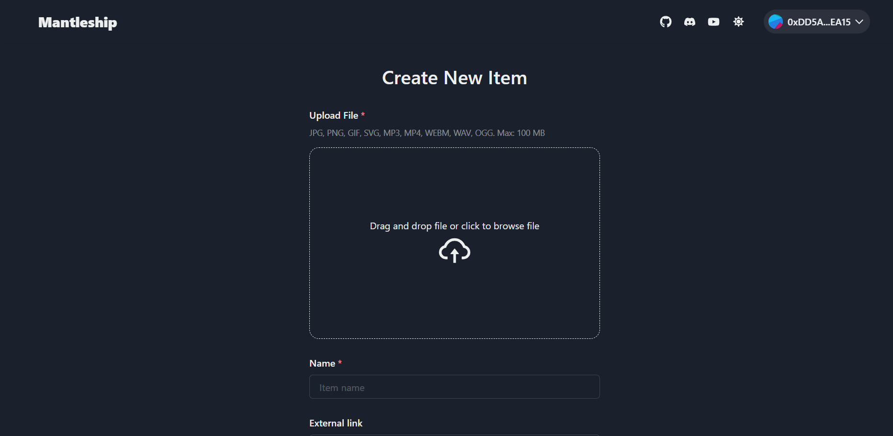
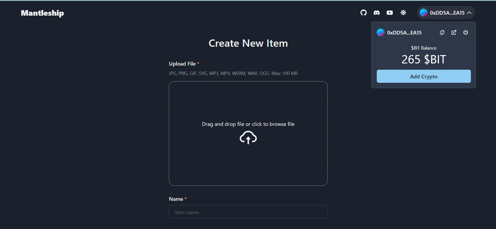

<div align="center">
  <a href="https://mantleship.vercel.app/">
    # Mantleship
  </a>
  <p align="center">
    An opensource dApp to create ERC721 collection and mint NFT on Mantle blockchain
    <br />
    <a href="https://mantleship.vercel.app/">Live Demo dApp</a> |
    <a href="https://vimeo.com/801374770">Demo video</a>
  </p>
</div>

# Home screenshot



# Address and balance UI



<!-- TABLE OF CONTENTS -->
<details open>
  <summary>Table of Contents</summary>
  <ol>
    <li>
      <a href="#about-the-project">About The Project</a>
      <ul>
        <li><a href="#built-with">Built With</a></li>
      </ul>
    </li>
    <li>
      <a href="#getting-started">Getting Started</a>
      <ul>
        <li><a href="#installation">Installation</a></li>
      </ul>
    </li>
    <li><a href="#roadmap">Roadmap</a></li>
    <li><a href="#contributing">Contributing</a></li>
    <li><a href="#license">License</a></li>
    <li><a href="#contact">Contact</a></li>
  </ol>
</details>

<!-- ABOUT THE PROJECT -->

## About The Project

<!-- [![Product Name Screen Shot][product-screenshot]](https://example.com) -->

Mantleship is a platform that will allow users to create, explore and sell extra-ordinary NFTs across multiple L1 and L2 blockchains. The platform allows users to import their existing NFT collection, customize their profile and share to friends on social media.
Only collection creation and NFT minting feature has been implemented for demo purposes while we continue work to deliver the complete project.

Mantleship NFT factory contract [Mantle explorer](https://explorer.testnet.mantle.xyz/address/0xfC264acFBA063360Fb4F39421593924A9aEDb489)

Mantleship Open Store collection contract [Mantle explorer](https://explorer.testnet.mantle.xyz/address/0x46720a2Bf86Fe20EF217B67a8B5E8Be820fa4c85)

### Built With

- [Next.js](https://nextjs.org/)
- [Chakra UI](https://chakra-ui.com/)
- [Pinata](https://pinata.cloud)
- [Solidity](https://soliditylang.org/)

<!-- GETTING STARTED -->

## Getting Started

To get started developing the project, you need to have the latest stable node and npm or yarn versions installed.

### Installation

1. Get a free API Key at [Pinata](https://www.pinata.cloud/)
2. Clone the repo
   ```sh
   git clone https://github.com/iphyman/mantleship.git
   ```
3. Install NPM packages
   ```sh
   yarn
   ```
4. Create and populate a .env.local file with the required credentials
5. To serve the UI compile contract and run test run below commands

```sh
yarn lerna run --scope @mantleship/interface dev
yarn lerna run --scope @mantleship/contracts compile
yarn lerna run --scope @mantleship/contracts test
```

## Roadmap

- [x] Minting
- [ ] Explore
- [ ] Marketplace
  - [ ] Auction
  - [ ] Buy Now
  - [ ] Offer

## Contributing

Contributions are what make the open source community such an amazing place to learn, inspire, and create. Any contributions you make are **greatly appreciated**.

If you have a suggestion that would make this better, please fork the repo and create a pull request. You can also simply open an issue with the tag "enhancement".
Don't forget to give the project a star! Thanks again!

1. Fork the Project
2. Create your Feature Branch (`git checkout -b feature/supportAcala`)
3. Commit your Changes (`git commit -m 'Add some supportAcala'`)
4. Push to the Branch (`git push origin feature/supportAcala`)
5. Open a Pull Request

<!-- LICENSE -->

## License

Distributed under the MIT License. See `LICENSE` for more information.

## Contact

- Discord - @iphyman#9280

## Progress

Active development continues in a private repository, will be opened to the general public after testing and launching of the complete marketplace in few weeks.
